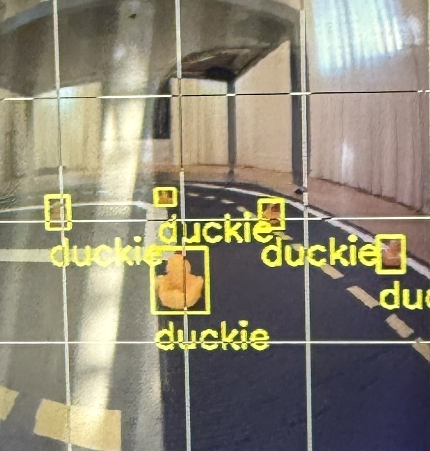

##### **DGMD E-17: Robotics, Autonomous Vehicles, Drones, and Artificial Intelligence**
# Real-Time Visual Obstacle Detection on Duckiebot DB21-J4 with NVIDIA Jetson Nano 4GB


## About
This project builds on the open-source Duckietown platform by deploying an autonomous robot with integrated object detection capabilities. It investigates how perception and control systems interact in real time, allowing the robot to identify and react to physical objects (represented by yellow rubber ducks) on the Duckietown road. The project emphasizes practical applications of computer vision and autonomous decision-making in a simplified yet dynamic setting.

## Background
The Duckiebot autonomously drives through a custom-built Duckietown layout, leveraging object detection to identify rubber ducks randomly positioned along the roadway. To support this functionality, we collect training data from the Duckietown simulator and use it to train a YOLOv5 object detection model. Once trained, the model will be integrated into the Duckietown autonomy stack to enhance the robot’s perception capabilities in real time.<br>


## Requirements
### Hardware ###
<ul>
  <li>Duckiebot DB21-J4 with NVIDIA Jeson Nano 4GB</li>  
</ul>

### Accounts | Software ###
<ul><li>Duckietown account with valid token (use dts1 not dts2)</li>
  <li>Duckietown shell command installed</li>
<li>Docker (installed and account set up)</li>
<li>Python (recommended: version 3.7 or higher)</li>
  <li>OpenCV - for computer vision and image processing</li>
  <li>YOLOv5 - for object detection and image recognition</li>
</ul>


## Instructions

<ol>
  <li>
    <strong>Set up the Duckietown environment</strong><br>
    After a DuckieBot is built, fork from the Duckietown GitHub repository: <a href="https://github.com/duckietown/duckietown-lx">duckietown-lx learning environment repository</a> and follow all the steps outlined in the 
    <a href="https://github.com/duckietown/duckietown-lx/blob/mooc2022/README.md">Duckietown-LX instructions</a>.<br>
    Then create your own GitHub repository to store and track your solution.
  </li><br>
  
  <li>
    <strong>Update your system</strong><br>
    Before proceeding, update all system packages and dependencies to ensure compatibility.<br>
    <pre><code>dts duckiebot update [your_robot_name]</code></pre>
  </li>
  
  <li>
    <strong>Integrate our solution</strong><br>
    Navigate to the <code>[exercise]/packages/solution</code> directory in your local <code>duckietown-lx</code> environment.<br>
    Replace <code>[exercise]</code> with the name of your specific module folder (e.g., <code>visual-lane-servoing</code> or <code>object-detection</code>).<br><br>
    Next, copy the files from this repository to your directory:<br>
    <a href="https://github.com/mimichen123/dgmd-e17/visual-lane-servoing">Visual Lane Servoing</a><br>
    <a href="https://github.com/mimichen123/dgmd-e17/object-detection">Object Detection</a><br><br>
    This step ensures this implementation is correctly integrated into the Duckietown autonomy stack.
  </li>
</ol>

## Test on Robot

First, evaluate work locally to check for errors:
```
dts code evaluate
```
Test on your robot our solution
```
dts code workbench --duckiebot [your_robot_name]
```

## Troubleshooting
Make sure you are logged into docker using dts
dts challenges config --docker-username <USERNAME> --docker-password <PASSWORD>

If you are getting errors, check that you have used dts1 token and not dts2 token
